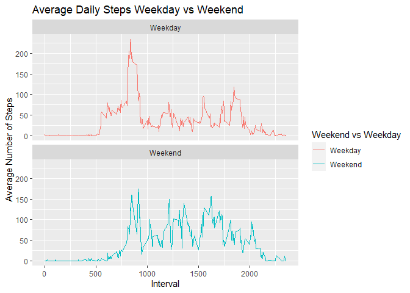

# Introduction

It is now possible to collect a large amount of data about personal movement using activity monitoring devices such as a Fitbit, Nike Fuelband, or Jawbone Up. These type of devices are part of the “quantified self” movement – a group of enthusiasts who take measurements about themselves regularly to improve their health, to find patterns in their behavior, or because they are tech geeks. But these data remain under-utilized both because the raw data are hard to obtain and there is a lack of statistical methods and software for processing and interpreting the data.

This Markdown document documents an assignment to make use of data from a personal activity monitoring device. This device collects data at 5 minute intervals through out the day. The data consists of two months of data from an anonymous individual collected during the months of October and November, 2012 and include the number of steps taken in 5 minute intervals each day.

The variables included in this dataset are:

steps: Number of steps taking in a 5-minute interval (missing values are coded as NA)

date: The date on which the measurement was taken in YYYY-MM-DD format

interval: Identifier for the 5-minute interval in which measurement was taken

The dataset is stored in a comma-separated-value (CSV) file and there are a total of 17,568 observations in this dataset.


## Loading and preprocessing the data

Here is the code I used to load and initially process the data.  The only processing needed at this point was to 1. download and unzip the data, 2. add columns for the day of week and weekend vs. weekday designation, adn 3. suppress warnings that were occuring due ot working with date/time formats witout full information (i.e. time zones identified).


```r
#load needed libraries
library(ggplot2)

#Suppress timezone warnings that happen with date manipulations
defaultW <- getOption("warn") 
options(warn = -1) 


#download and read data file once to save time
data_file <- "repdata_data_activity.zip"

if (!file.exists(data_file)) {
  download_url <- "https://d396qusza40orc.cloudfront.net/repdata%2Fdata%2Factivity.zip"
  download.file(download_url, destfile = data_file)
  unzip (zipfile = data_file)
}

if (!exists("activity")) {
  activity <- read.csv("activity.csv") 
#Add day of week
  activity$date <- as.POSIXct(activity$date,"%m%d%Y")
  day <- weekdays(activity$date)
  activity <- cbind(activity, day)
#Add weekdays or weekends
  activity$date <- as.Date(strptime(activity$date, format="%Y-%m-%d"))
  activity$daytype <- sapply(activity$date, function(x) {
    if(weekdays(x) == "Saturday" | weekdays(x) == "Sunday")
    {y <- "Weekend"}
    else {y <- "Weekday"}
    y
  })
}

#enable warnings again
options(warn = defaultW)
```

## What is mean total number of steps taken per day?
Here is the code that investigated the mean number of steps taken per day.

```r
#Calculate total steps on a day
activitytotal <- with(activity, aggregate(steps, by = list(date), sum, na.rm = TRUE))
#Add names
names(activitytotal) <- c("Date", "Steps")

#Get Mean and Median
mean(activitytotal$Steps)
```

```
## [1] 9354.23
```

```r
median(activitytotal$Steps)
```

```
## [1] 10395
```

```r
#Convert data set to data frame
totaldf <- data.frame(activitytotal)

#Plot histogram using ggplot2
Q1plot <- ggplot(totaldf, aes(x = Steps)) + 
  geom_histogram(breaks = seq(0, 25000, by = 2500), fill = "blue", col = "black") + 
  xlab("Total Steps Per Day") + 
  ylab("Frequency") + 
  ggtitle("Total Steps Taken on a Day")

print(Q1plot)
```

<!-- -->

This shows the mean as 9354.2295082 and the median as 10395

## What is the average daily activity pattern?
To investigate the average daily activity pattern, the following code was used.

```r
#Calculate average steps across all days by 5-min intervals
dailyaverage <- aggregate(activity$steps, by = list(activity$interval), 
                                  FUN = mean, na.rm = TRUE)
#Add names
names(dailyaverage) <- c("Interval", "Mean")

#Max interval
dailyaverage[which.max(dailyaverage$Mean), ]$Interval
```

```
## [1] 835
```

```r
#Convert to a dataframe
averagedf <- data.frame(dailyaverage)

#Plot time series
Q2Plot <- ggplot(averagedf, mapping = aes(Interval, Mean)) + 
  geom_line(col = "blue") +
  xlab("Interval") + 
  ylab("Average Number of Steps") + 
  ggtitle("Average Number of Steps Per Interval")

print(Q2Plot)
```

<!-- -->

This shows that the 5-minute interval that, on average, contains the maximum number of steps is 835


## Imputing missing values
A number of values were missing (NA) in the data.  I replaced these values with the mean of the dataset to see what changes would be introduced and allow comparison to the first question.  Here is that code.


```r
missingsum<-sum(is.na(activity$steps))

missingindex<-is.na(activity[,1])

dm<-mean(dailyaverage$Mean)

activity1<-activity
activity1[missingindex,1]<-dm

#Calculate total steps on a day
activitytotal1 <- with(activity1, aggregate(steps, by = list(date), sum, na.rm = TRUE))
#Add names
names(activitytotal1) <- c("Date", "Steps")

#Get Mean and Median
mean(activitytotal1$Steps)
```

```
## [1] 10766.19
```

```r
median(activitytotal1$Steps)
```

```
## [1] 10766.19
```

```r
#Convert data set to data frame
totaldf1 <- data.frame(activitytotal1)

#Plot histogram using ggplot2
Q3plot <- ggplot(totaldf1, aes(x = Steps)) + 
  geom_histogram(breaks = seq(0, 25000, by = 2500), fill = "blue", col = "black") + 
  xlab("Total Steps Per Day with Imputed Data") + 
  ylab("Frequency") + 
  ggtitle("Total Steps Taken on a Day with Imputed Data")

print(Q3plot)
```

<!-- -->


## Are there differences in activity patterns between weekdays and weekends?

The final investigation of the data was to compare step activity on weekdays and weekends.  Here is that code.

```r
activitybyday <-  aggregate(steps ~ interval + daytype, activity, mean, na.rm = TRUE)

#Plot weekday vs weekend activity
Q4Plot <-  ggplot(activitybyday, 
  aes(x = interval, 
    y = steps, 
    color = daytype)) + 
    geom_line() + 
    ggtitle("Average Daily Steps Weekday vs Weekend") + 
    xlab("Interval") + 
    ylab("Average Number of Steps") +
    facet_wrap(~daytype, ncol = 1, nrow=2) +
    scale_color_discrete(name = "Weekend vs Weekday")

print(Q4Plot)
```

<!-- -->
